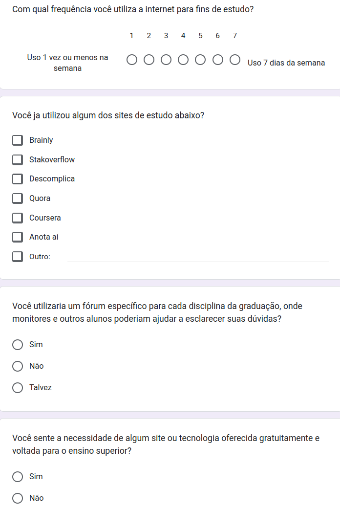
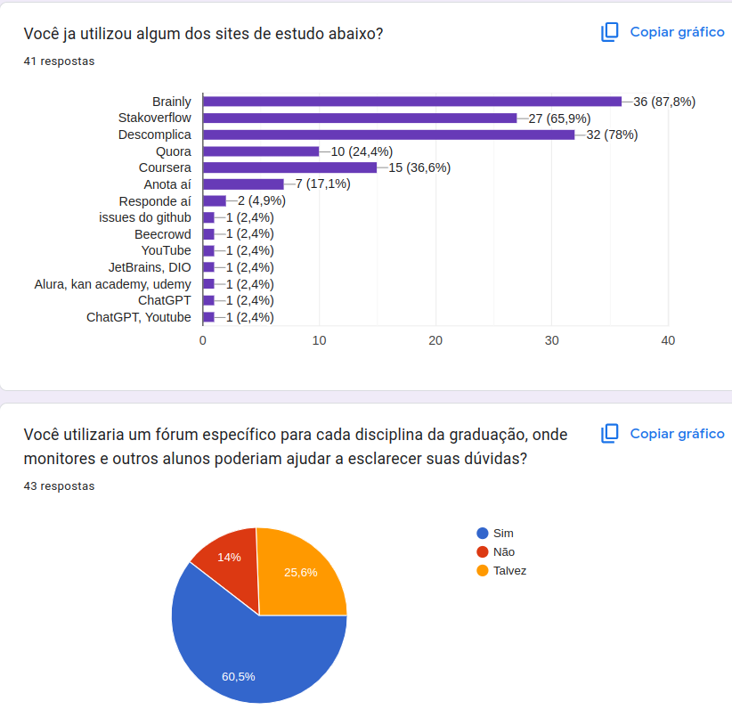
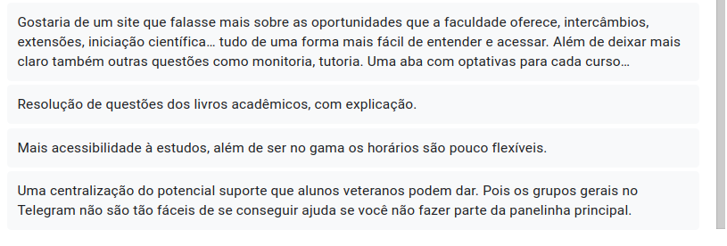

Este documento é o artefato da ideia apelidada de Brainly, e baseada na plataforma de mesmo nome, que foi gerada pelo brainstorm da equipe G3.

## <a> Descrição da ideia - 5W2H </a>

### What(O que)?
Fórum interativo voltado para as matérias e o contexto da FGA

### Why (Por quê)?
Centralizar e facilitar o conhecimento da FGA, bem como permitir a retirada de dúvidas de forma assíncrona, online e pela própria comunidade.

### Who (Quem)?
Alunos, monitores e professores. 

### Where (Onde?)?
Aplicação mobile

### When?
Todos os dias, o fórum é assíncrono e pode ser acessado a qualquer momento.

### How?
Para as respostas dos alunos, haverá um esquema de votação e para classificação quanto a relevância da respostas. No caso de monitores e professores daquela matéria, a resposta será validada, estes também podendo aprovar respostas de alunos.

### How Much?
O fórum será de uso gratuito, o desenvolvimento também será realizado de forma gratuita pelos estudantes de arquitetura do Grupo G3.

## <a> Como a viabilidade foi pesquisada </a>
Foi criado um google forms, contendo além do termo de consentimento e de parguntas de levantamento bibliográfico, as perguntas abaixo:

Além de perguntas abertas pedindo sugestões e ideias para a plataforma.

## <a> Divulgação </a>
Divulgamos o link do Google forms para todos os grupos dos alunos da FGA que os membros estavam e logo na primeira hora já obtivemos mais de 15 respostas. Esse forms demora menos de um minuto para ser respondido e acreditamos que isso facilitou a quantidade de respostas sem comprometes nossa pesquisa de mercado.

## <a> Resultados da pesquisa </a>
Obtivemos 43 respostas ao forms no total.

Quanto ao levantamento demográfico, podemos observar que o público da fga é majoritariamente composta de estudantes de software entre 18 e 24 anos.

Pela imagem abaixo, também podemos observar que a maioria já se utilizou de plataformas educacionais alheias as da faculdade,  e a maioria utilizaria o fórum.

A maioria vê necessidade da existência de uma tecnologia gratuita e voltada para o ensino superior

Abaixo temos as sugestões dos alunos quanto a plataforma:

Dos 43, 11 alunos deixaram dados de contato para que pudéssemos consultá-los quanto á suas necessidades e caso desejassem ser nossos clientes.

## <a> Desdobramentos inesperados</a>

Recebemos uma mensagem de uma aluna pouco tempo após o início da divulgação. Ela comunicou que aquela ideia era a mesma que já sendo desenvolvida por ela em seu TCC e pediu encarecidamente que não seguíssemos com essa ideia, a fim de evitar problemas. Ela e sua dupla também já iniciaram o desenvolvimento da plataforma e faz parte de seu TCC desenvolvê-lo, logo também não seria possível dela se tornar nossa cliente e nós desenvolvermos o fórum.

## <a> Análise e conclusão </a>

Devido ao desdobramento inesperado e dessa sobreposição de ideias, o Grupo G3 decidiu não seguir com essa ideaia do Brainly, preferindo investir mais nas outras ideias geradas pelo Brainstorm, como a ideia do Enem e do Duolingo.

No entanto, graças ao google forms criados, recebemos muitas sugestões e ideias de plataformas educacionais, que é nosso tema. Dessa forma, mesmo que essa ideia não seja desenvolvida, essa análise enriqueceu o grupo com insights para os outros temas.