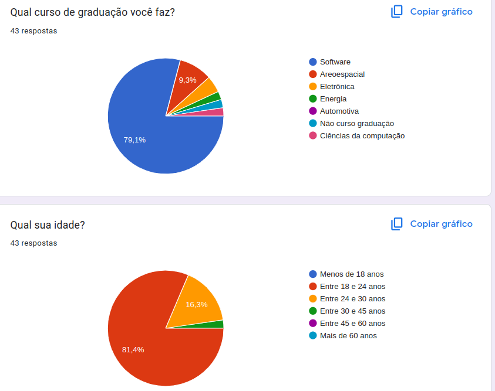
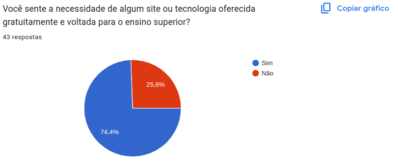

## <a>1. Introdução </a>

Este artefato documenta o processo de pesquisa realizado para identificar as principais necessidades e preferências dos alunos a fga em relação a um fórum da comunidade, ideia apelidada de Brainly, e baseada na plataforma de mesmo nome, um dos temas debatidos durante o [Brainstorming](https://unbarqdsw2024-2.github.io/2024.2_G3_Aprender_Entrega_01/#/DesignSprint/brainstorming). Este documento detalha as etapas de elaboração do questionário, a coleta de dados e a análise das respostas, visando servir como base para o entendimento dos recursos e funcionalidades mais desejados pelo público-alvo. 

## <a>2. Metodologia </a>

A metodologia usada nessa pesquisa foi a mesma usada na pesquisa da ideia do [Enem](https://github.com/UnBArqDsw2024-2/2024.2_G3_Aprender_Entrega_01/blob/main/docs/Artefatos/enem.md), ou seja, definir e detalhar a ideia por meio da técnica 5W2H, criar um formulário de pesquisa no google forms e divulgá-lo para uma amostra do público alvo.

## <a>3. Descrição da ideia - 5W2H </a>

### What(O que)?
Fórum interativo voltado para as matérias e o contexto da FGA

### Why (Por quê)?
Centralizar e facilitar o conhecimento da FGA, bem como permitir a retirada de dúvidas de forma assíncrona, online e pela própria comunidade.

### Who (Quem)?
Alunos, monitores e professores. 

### Where (Onde?)?
Aplicação mobile

### When?
Todos os dias, o fórum é assíncrono e pode ser acessado a qualquer momento.

### How?
Para as respostas dos alunos, haverá um esquema de votação e para classificação quanto a relevância da respostas. No caso de monitores e professores daquela matéria, a resposta será validada, estes também podendo aprovar respostas de alunos.

### How Much?
O fórum será de uso gratuito, o desenvolvimento também será realizado de forma gratuita pelos estudantes de arquitetura do Grupo G3.

## <a>4. Formulário </a>
Foi criado um google forms, contendo além do termo de consentimento e de perguntas de levantamento demográfico, perguntas abertas pedindo sugestões e ideias para a plataforma e as perguntas da imagem 1.

<figure markdown>

<b>Imagem 1</b> - Perguntas do questionário

Fonte: [Giovanni Alvissus](https://github.com/giovanniacg)

</figure>

## <a> Divulgação </a>
Divulgamos o link do Google forms para todos os grupos dos alunos da FGA que os membros estavam e logo na primeira hora já obtivemos mais de 15 respostas. Esse forms demora menos de um minuto para ser respondido e acreditamos que isso facilitou a quantidade de respostas sem comprometes nossa pesquisa de mercado.

## <a> Resultados da pesquisa </a>
Obtivemos 43 respostas ao forms no total.

Quanto ao levantamento demográfico, podemos observar pela imagem 2 que o público da fga é majoritariamente composta de estudantes de software entre 18 e 24 anos. Como pode ser observado na imagem 3, também podemos observar que a maioria já se utilizou de plataformas educacionais alheias as da faculdade,  e a maioria utilizaria o fórum. Segundo a imagem 4, a maioria vê necessidade da existência de uma tecnologia gratuita e voltada para o ensino superior. A imagem 5 e a imagem 6 mostram as sugestões dos alunos quanto a plataforma. Dos 43 alunos que responderam, 11 deixaram dados de contato para que pudéssemos consultá-los quanto á suas necessidades e caso desejassem ser nossos clientes.

<figure markdown>

<b>Imagem 2</b> - Respostas questionário - levantamento demográfico

Fonte: [Giovanni Alvissus](https://github.com/giovanniacg)

</figure>

<figure markdown>

<b>Imagem 3</b> - Respostas questionário

Fonte: [Giovanni Alvissus](https://github.com/giovanniacg)

</figure>

<figure markdown>

<b>Imagem 4</b> - Respostas questionário

Fonte: [Giovanni Alvissus](https://github.com/giovanniacg)

</figure>

<figure markdown>

<b>Imagem 5</b> - Respostas questionário

Fonte: [Giovanni Alvissus](https://github.com/giovanniacg)

</figure>

<figure markdown>

<b>Imagem 6</b> - Respostas questionário

Fonte: [Giovanni Alvissus](https://github.com/giovanniacg)

</figure>

## <a>5. Desdobramentos inesperados</a>

Recebemos uma mensagem de uma aluna pouco tempo após o início da divulgação. Ela comunicou que aquela ideia era a mesma que já sendo desenvolvida por ela em seu TCC e pediu encarecidamente que não seguíssemos com essa ideia, a fim de evitar problemas. Ela e sua dupla também já iniciaram o desenvolvimento da plataforma e faz parte de seu TCC desenvolvê-lo, logo também não seria possível dela se tornar nossa cliente e nós desenvolvermos o fórum.

## <a>6. Análise e conclusão </a>

Devido ao desdobramento inesperado e dessa sobreposição de ideias, o Grupo G3 decidiu não seguir com essa ideaia do Brainly, preferindo investir mais nas outras ideias geradas pelo Brainstorm, como a ideia do Enem e do Duolingo.

No entanto, graças ao google forms criados, recebemos muitas sugestões e ideias de plataformas educacionais, que é nosso tema. Dessa forma, mesmo que essa ideia não seja desenvolvida, essa análise enriqueceu o grupo com insights para os outros temas.

## <a>7. Referências</a>

> <a id="REF1" href="#anchor_1">1.</a> Barbosa, S. D. J.; Silva, B. S. da; Silveira, M. S.; Gasparini, I.; Darin, T.; Barbosa, G. D. J. (2021) *Interação Humano-Computador e Experiência do usuário.* Capítulo 13 Tópicos Especiais, tópico 13.1 Gamificação, página 325. Autopublicação. ISBN: 978-65-00-19677-1.

> <a id="REF2" href="#anchor_2">2.</a> Google Forms. Disponível em: [https://www.google.com/intl/pt-BR/forms/about/](https://www.google.com/intl/pt-BR/forms/about/). Acesso em: 25 de out de 2024

> <a id="REF3" href="#anchor_3">3.</a> Slides de BPMN da professora Milene. Acesso em: 25 de out de 2024

## <a>8. Histórico de Versão</a>

| Versão | Data | Data Prevista de Revisão | Descrição | Autor(es) | Revisor(es) | Descrição da revisão |
| :------: | :----------: | :-----------: | :-----------: | :---------: | :---------: | :---------: |
| `1.0` | 25/10/2024 | 30/10/2024 | Criação do Documento| [Ana Carolina Costa César](https://github.com/CarolCoCe) | [Giovanni Alvissus](https://github.com/giovanniacg) | Colocar fonte, metodologia e o histórico de versão|
| `2.0` | 01/11/2024 |02/11/2024 | Melhorando o doc conforme a revisão| [Ana Carolina Costa César](https://github.com/CarolCoCe) | [Giovanni Alvissus](https://github.com/giovanniacg) | Refatorar diretorio das imagens |