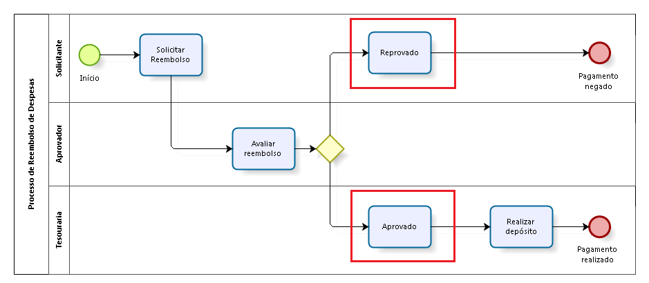
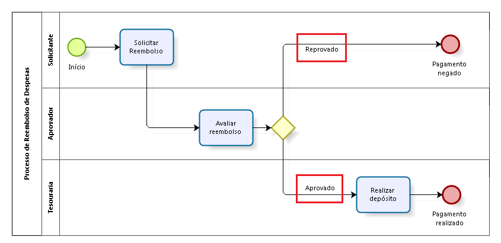
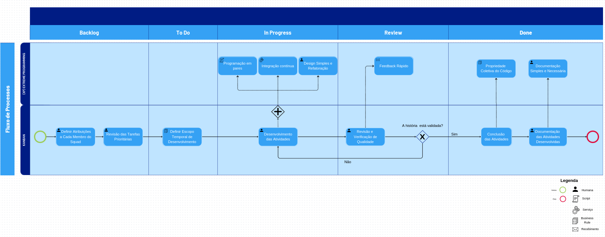

# <a> 1.3. Módulo Modelagem BPMN </a>

## <a>1.3.1 - BPMN </a>

O Business Process Model and Notation (BPMN) é uma notação gráfica padronizada para modelagem de processos. O BPMN representa fluxos de atividades em diagramas, utilizando símbolos como eventos, atividades, gateways e fluxos de sequência para descrever detalhadamente como os processos operacionais de uma organização funcionam. Sua importância se destaca especialmente em sistemas de informação e em projetos onde o entendimento do fluxo de trabalho é essencial para o desenvolvimento, manutenção e otimização de softwares que atendam às necessidades reais das empresas.

Suas principais abstrações são: pool, lane, milestone, conectores, atividades, sub-processos, call activity, eventos, gateways, item e dados.

> Fonte: Slides - Aula BPMN - Professora Milene

### <a> Exemplos de construções de BPMN </a>

> Fonte: https://blog.iprocess.com.br/

## <a> 1.3.2 Metodologia </a>

A equipe ao todo decidiu reorganizar o time em pequenos squads de 4 pessoas, onde cada squad será responsável por desenvolver sua própria metodologia. Sendo assim, cada squad foi responsável por decidir sua própria metodologia de processos. É possível ver na tabela abaixo o modelo utilizado por cada equipe.

| Nº Squad | Abordagem |Metodologia |
|-------|--------------|------------|
| 1     |              |            |
| 2     |              |            |
| 3     |Híbrida| Kanbam, XP(Extreme Programming) |

<!-- ### <a> Metologia Squad 1 </a>

### <a> Metologia Squad 2 </a> -->

### <a> Metologia - Squad 3 </a>

O Squad 3 optou por adotar as metodologias Kanban e Extreme Programming (XP) para o projeto, visando uma abordagem equilibrada entre organização visual e eficiência no desenvolvimento. O uso do Kanban permite que a equipe visualize de forma clara as etapas do fluxo de trabalho, facilitando a identificação de gargalos e ajudando a manter o foco nas tarefas em andamento. Isso traz uma organização transparente ao projeto, além de permitir ajustes rápidos nas atividades de acordo com as prioridades que surgem. Isso fica bastante claro quando analisar o fluxo de processo pelo modelo BPMN.

> Fonte: [Danilo Naves](https://github.com/DaniloNavesS), [Eric Silveira](https://github.com/ericbky), [Luiz Gustavo](https://github.com/LuizGust4vo), [Gustavo Roberto](https://github.com/gusrberto). 

Além disso, ao utilizar o Extreme Programming (XP), o squad 3 busca elevar a qualidade do código e garantir um ritmo sustentável de desenvolvimento. As práticas de XP, como programação em pares, revisões frequentes e aplicação de design simples e refatoração aumentam a confiança no código produzido e reduzem os riscos de problemas no futuro. Essa metodologia também reforça o feedback constante e a colaboração, que são fundamentais para que a equipe e o produto evolua no processo de desenvolvimento.

A combinação de Kanban com XP oferece ao squad uma base sólida para lidar com mudanças de maneira ágil, mantendo o fluxo organizado e a qualidade técnica do projeto elevada.

## <a>Referências </a>

IPROCESS. Problemas comuns na modelagem de processos em BPMN III – uso de tarefas para sinalizar o resultado de gateways. Blog IProcess, 25 jan. 2018. Disponível em: https://blog.iprocess.com.br/2018/01/problemas-comuns-na-modelagem-de-processos-em-bpmn-iii-%E2%80%93-uso-de-tarefas-para-sinalizar-o-resultado-de-gateways/. Acesso em: 2 nov. 2024.

SERRANO, Milene. Arquitetura e Desenho de Software - Aula BPMN Exemplos. 2024. Disponível em: https://aprender3.unb.br/pluginfile.php/2928935/mod_page/content/1/Arquitetura%20e%20Desenho%20de%20software%20-%20Aula%20BPMN%20Exemplos%20-%20Profa.%20Milene.pdf. Acesso em: 02 nov. 2024.

## <a>Histórico de Versão</a>

| Versão | Data | Data Prevista de Revisão | Descrição | Autor(es) | Revisor(es) |
| :------: | :----------: | :-----------: | :-----------: | :---------: | :---------: |
| `1.0` | 03/11/2024 | 03/11/2024 | BPMN - Criação de página e adição de metodologia squad 3 | [Danilo Naves](https://github.com/DaniloNavesS), [Luiz Gustavo](https://github.com/LuizGust4vo)  | [Eric Silveira](https://github.com/ericbky), [Gustavo Roberto](https://github.com/gusrberto) | 