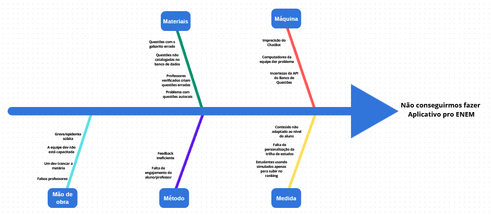

## <a>1. Introdução</a>

A equipe utilizou o Diagrama de Ishikawa para identificar as causas dos problemas no desenvolvimento do projeto. Os membros [Ana Carolina](https://github.com/CarolCoCe), [Felipe Motta](https://github.com/M0tt1nh4) e [João Artur Leles](https://github.com/joao-artl) se reuniram via [Microsoft Teams](https://teams.microsoft.com/v2/), onde colaboraram na listagem e categorização das principais causas, como "Mão de Obra" e "Métodos". O diagrama foi criado de forma colaborativa no [Canva](https://www.canva.com/), o que facilitou a organização visual e a análise dos fatores críticos.

## <a>2. Metodologia</a>

O Diagrama de Ishikawa, ou diagrama de espinha de peixe, é uma ferramenta visual desenvolvida por Kaoru Ishikawa para identificar e organizar causas potenciais de problemas em processos. Apresentado no livro What is Total Quality Control? The Japanese Way<a>^1^</a>, Ishikawa explica que o diagrama visa facilitar a identificação das raízes de problemas complexos, promovendo a melhoria contínua na qualidade. Estruturalmente, o diagrama se assemelha a uma espinha de peixe, onde o problema principal é posicionado à direita, enquanto as causas potenciais são dispostas como “espinhas” principais e subdivisões, permitindo uma visão clara e organizada.

Tradicionalmente, o diagrama contém seis espinhas principais: Método, Máquina, Medida, Meio Ambiente, Mão de Obra e Material. Essas categorias ajudam a examinar aspectos específicos que podem estar influenciando o problema, facilitando uma análise detalhada. No entanto, para o projeto em questão, o diagrama foi adaptado, excluindo a espinha “Meio Ambiente”, pois essa categoria não era necessária no contexto específico. Essa modificação permitiu um foco mais direto nas áreas relevantes, mantendo a efetividade da análise sem elementos irrelevantes.

## <a>3. Quadro Utilizado</a>

A imagem 1 abaixo apresenta o diagrama elaborado pelos membros da equipe:

<figure markdown>

<b>Imagem 1</b> - Diagrama de Ishikawa

 

Fonte: [Ana Carolina](https://github.com/CarolCoCe), [Felipe Motta](https://github.com/M0tt1nh4) e [João Artur Leles](https://github.com/joao-artl)

</figure>

## <a>4. Conclusão </a>

O Diagrama de Ishikawa para o desenvolvimento do aplicativo voltado ao ENEM revela cinco categorias principais de fatores que podem contribuir para o insucesso do projeto: Materiais, Máquina, Mão de obra, Método e Medição. Esses fatores abrangem uma variedade de problemas, desde questões técnicas, como erros no banco de questões e imprecisões no chatbot, até aspectos humanos, como a falta de capacitação da equipe e o engajamento dos usuários. Essa análise indica que esses desafios precisam ser enfrentados de forma proativa para garantir o andamento eficaz do projeto.

Para que o escopo do projeto se torne viável, é importante garantir a qualidade dos materiais educacionais e investir na capacitação da equipe. A implementação de métodos de ensino mais engajadores e personalizados, bem como a adequação das ferramentas tecnológicas às demandas de dados, também são fundamentais. Além disso, a medição e o ajuste contínuo do conteúdo de acordo com o nível dos usuários são essenciais para garantir que o aplicativo atenda às necessidades dos estudantes. Com um planejamento focado na mitigação desses problemas, o aplicativo pode se tornar uma ferramenta eficaz para auxiliar os estudantes em sua preparação para o ENEM.

## <a>Referências Bibliográficas</a>

> <a>1.</a> ISHIKAWA, Kaoru. What is Total Quality Control? The Japanese Way. 1. ed. Englewood Cliffs: Prentice Hall, 1985.

## <a>Histórico de Versão</a>

| Versão | Data | Data Prevista de Revisão | Descrição | Autor(es) | Revisor(es) |
| :------: | :----------: | :-----------: | :-----------: | :---------: | :---------: |
| `1.0` | 02/11/2024 | 03/11/2024 | Criação do Documento| [João Artur Leles](https://github.com/joao-artl) | - |