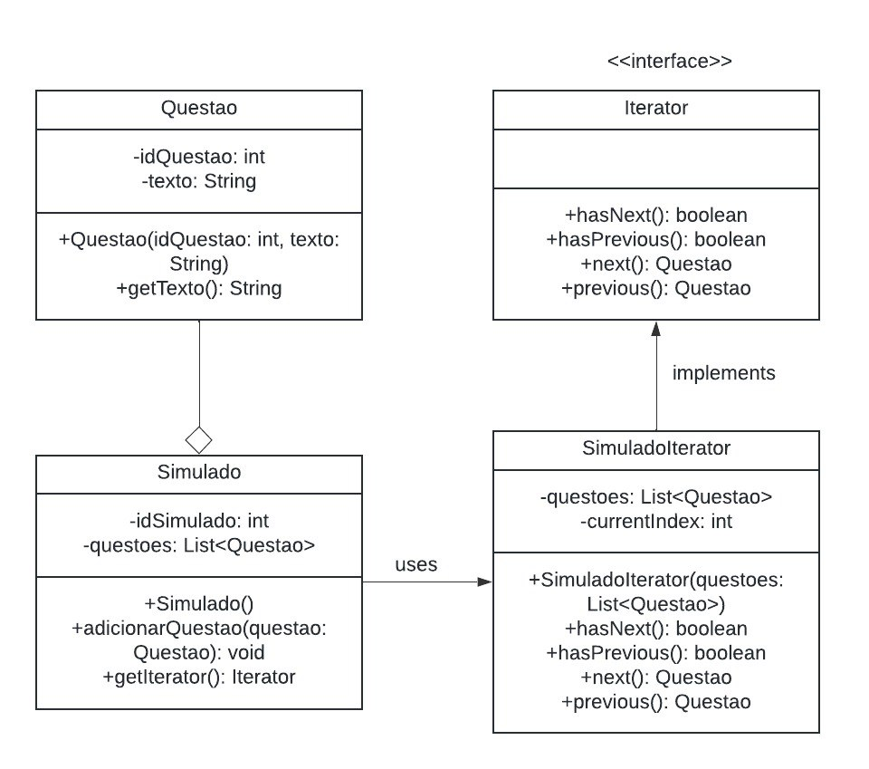
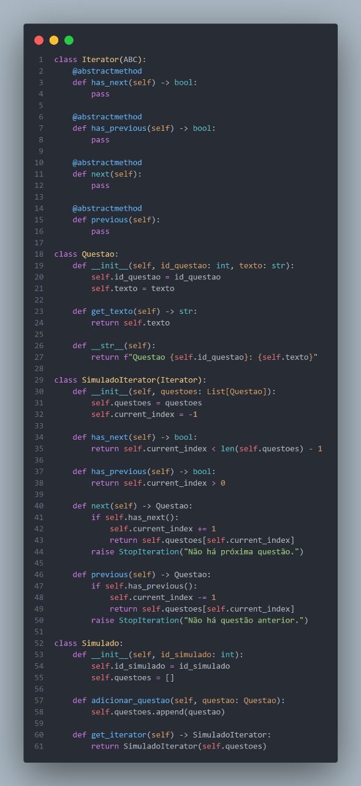

# **Iterator**

## **1. Introdução**

O Iterator é um padrão de projeto comportamental que permite a você percorrer elementos de uma coleção sem expor as representações dele. Além de implementar o algoritmo em si, um objeto iterador encapsula todos os detalhes da travessia, tais como a posição atual e quantos elementos faltam para chegar ao fim. Por causa disso, alguns iteradores podem averiguar a mesma coleção ao mesmo tempo, independentemente um do outro.

## **2. Metodologia**

A metodologia adotada pelo squad 1 para a elaboração do UML Iterator foi de estudos individuais inicialmente com discussões para a elaboração do diagrama. A próxima etapa foi de reuniões para formular o GoF. Foi utilizado como referência o Brain Storming realizado na primeira entrega e principalmente o diagrama de classes, além da aula disponibilizada pela professora com os slides sobre GoFs.

## **3. Diagramas**

 A interface Iterator estabelece uma abstração comum para a navegação em coleções. A classe Questao funciona como a unidade básica da coleção, representando uma questão individual com atributos como identificador e texto. Já a classe Simulado age como uma composição, agrupando múltiplas questões e delegando a lógica de iteração para a classe SimuladoIterator.

O SimuladoIterator implementa a interface Iterator e fornece métodos específicos para navegar pelos elementos da coleção. Essa estrutura modular permite a manipulação uniforme de coleções simples (Questao) e compostas (Simulado).

<center>

<figure markdown>
<font size="3"><p style="text-align: center"><b>Imagem 1</b> - GoF Iterator</p></font>



<font size="3"><p style="text-align: center">Fonte: [Paulo Henrique](https://github.com/paulomh), [Diegou Sousa](https://github.com/DiegoSousaLeite), [Arthur Alves](https://github.com/arthrok), [Julio Cesar](https://github.com/julio-dourado)</p></font>

</figure>

</center>

## **4. Implementação**

Códigos do GoF Comportamental - Iterator

<center>

<figure markdown>
<font size="3"><p style="text-align: center"><b>Imagem 2</b> Códigos Iterator</p></font>



<font size="3"><p style="text-align: center">Fonte: [Danilo Naves](https://github.com/DaniloNavesS), [Eric Silveira](https://github.com/ericbky), [Gustavo Roberto](https://github.com/gusrberto) e [Luiz Gustavo](https://github.com/LuizGust4vo)</p></font>

</figure>

</center>

**Saída do Código**

Ao executar o código acima, a saída será:

```
Navegando para frente:
Questao 1: O que é POO?
Questao 2: O que é Herança?
Questao 3: O que é Polimorfismo?

Navegando para trás:
Questao 2: O que é Herança?
Questao 1: O que é POO?
```

## **6. Análise e conclusão**

Conclusão a partir dos diagramas

## **Referências Bibliográficas**

> <a id="REF1" href="#anchor_1">1.</a> Iterator, Refactoring Guru. Disponível em: [https://refactoring.guru/pt-br/design-patterns/iterator](https://refactoring.guru/pt-br/design-patterns/iterator). Acesso em: 03 de jan de 2025.

> <a id="REF2" href="#anchor_2">2.</a> Diagrama de Classes, G3. Disponível em: [https://unbarqdsw2024-2.github.io/2024.2_G3_Aprender_Entrega_02/#/Modelagem/2.1.2.DiagramaClasses](https://unbarqdsw2024-2.github.io/2024.2_G3_Aprender_Entrega_02/#/Modelagem/2.1.2.DiagramaClasses). Acesso em: 03 de jan de 2025.

> <a id="REF3" href="#anchor_3">3.</a> Brain Storming, G3. Disponível em: [https://unbarqdsw2024-2.github.io/2024.2_G3_Aprender_Entrega_01/#/Artefatos/brainstorming](https://unbarqdsw2024-2.github.io/2024.2_G3_Aprender_Entrega_01/#/Artefatos/brainstorming). Acesso em: 03 de jan de 2025.

## **Histórico de Versão**

| Versão | Data       | Data de Revisão          | Descrição            | Autor(es)                       | Revisor(es)                       | Detalhes da revisão        |
| ------ | ---------- | ------------------------ | -------------------- | ------------------------------- | --------------------------------- | -------------------------- |
| `1.0`| 05/01/2025 | 05/01/2025 | Criação do Documento | [Felipe Motta](https://github.com/M0tt1nh4) | [Ana Carolina](https://github.com/CarolCoCe), [Giovanni Giampauli](https://github.com/giovanniacg), [João Artur Leles](https://github.com/joao-artl) | - |