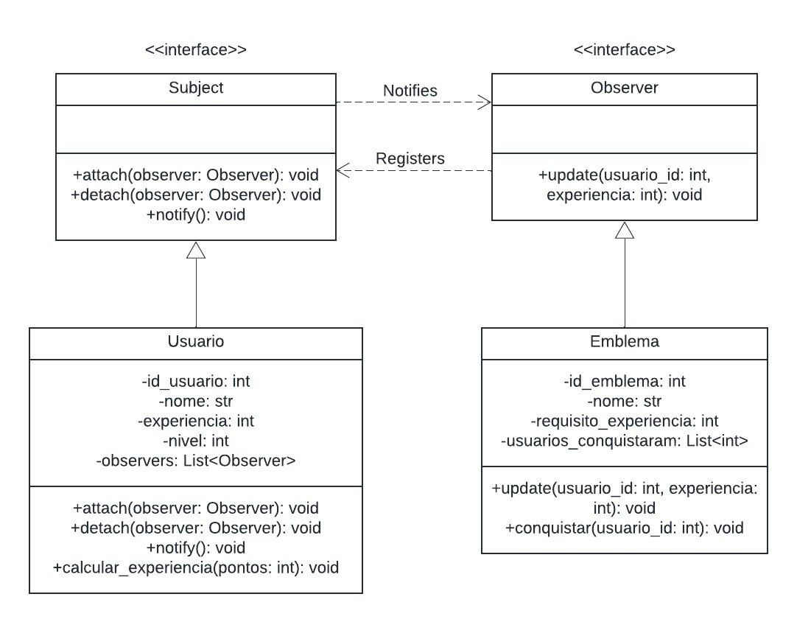

# **Observer**

## **1. Introdução**

O Observer é um padrão de projeto comportamental que permite que você defina um mecanismo de assinatura para notificar múltiplos objetos sobre quaisquer eventos que aconteçam com o objeto que eles estão observando.

## **2. Metodologia**

A metodologia adotada pelo squad 1 para a elaboração do UML Observer foi de estudos individuais inicialmente com discussões para a elaboração do diagrama. A próxima etapa foi de reuniões para formular o GoF. Foi utilizado como referência o Brain Storming realizado na primeira entrega e principalmente o diagrama de classes, além da aula disponibilizada pela professora com os slides sobre GoFs.

## **3. Diagramas**

A interface Subject define os métodos básicos para gerenciar os observadores. A classe Usuario implementa essa interface, representando o sujeito observado.

A interface Observer define o método update, que é chamado pelo sujeito para informar os observadores sobre mudanças no estado. A classe Emblema implementa essa interface, representando um observador que monitora o progresso do usuário.

Essa estrutura modular permite que múltiplos emblemas monitorem o progresso de um usuário sem que o sujeito (Usuario) precise conhecer detalhes sobre seus observadores.

<center>

<figure markdown>
<font size="3"><p style="text-align: center"><b>Imagem 1</b> - GoF Observer</p></font>



<font size="3"><p style="text-align: center">Fonte: [Paulo Henrique](https://github.com/paulomh), [Diegou Sousa](https://github.com/DiegoSousaLeite), [Arthur Alves](https://github.com/arthrok), [Julio Cesar](https://github.com/julio-dourado)</p></font>

</figure>

</center>

## **4. Implementação**

Códigos do GoF Comportamental - Observer - Emblema-Usuário

<center>

<figure markdown>
<font size="3"><p style="text-align: center"><b>Imagem 2</b> Códigos Observer</p></font>


<font size="3"><p style="text-align: center">Fonte: [Danilo Naves](https://github.com/DaniloNavesS), [Eric Silveira](https://github.com/ericbky), [Gustavo Roberto](https://github.com/gusrberto) e [Luiz Gustavo](https://github.com/LuizGust4vo)</p></font>

</figure>

</center>

**Saída do Código**

Ao executar o código acima, a saída será:

```
Usuário João ganhou 5 pontos de experiência. Experiência total: 5
Usuário João ganhou 10 pontos de experiência. Experiência total: 15
Usuário 1 conquistou o emblema 'Iniciante'!
Usuário João ganhou 40 pontos de experiência. Experiência total: 55
Usuário 1 conquistou o emblema 'Veterano'!
```


Códigos do GoF Comportamental - Observer - Timer

<center>

<figure markdown>
<font size="3"><p style="text-align: center"><b>Imagem 3</b> Códigos Observer</p></font>


<font size="3"><p style="text-align: center">Fonte: [Danilo Naves](https://github.com/DaniloNavesS), [Eric Silveira](https://github.com/ericbky), [Gustavo Roberto](https://github.com/gusrberto) e [Luiz Gustavo](https://github.com/LuizGust4vo)</p></font>

</figure>

</center>

**Saída do Código**

Ao executar o código acima, a saída será:

```
Timer iniciado.
Simulado 1 atualizado. Novo estado: iniciado
Simulado 2 atualizado. Novo estado: iniciado
Tempo limite atingido. Timer finalizado.
Simulado 1 atualizado. Novo estado: finalizado
Simulado 1 foi finalizado automaticamente.
Simulado 2 atualizado. Novo estado: finalizado
Simulado 2 foi finalizado automaticamente.
```

## **6. Análise e conclusão**

O padrão de projeto Observer permite que múltiplos objetos sejam notificados de mudanças no estado de um sujeito de forma desacoplada. A estrutura apresentada, com a interface Subject e os observadores independentes, promove flexibilidade e escalabilidade, facilitando a adição de novos observadores sem impactar o código existente.

Os exemplos ilustram o monitoramento do progresso de conquistas e controle de timers em simulados, evidenciando a função do Observer no gerenciamento do sistema. Dessa forma, problemas como comunicação entre objetos torna-se quase nula, mantendo os princípios de design modular e reutilização.

## **Referências Bibliográficas**

> <a id="REF1" href="#anchor_1">1.</a> Observer, Refactoring Guru. Disponível em: [https://refactoring.guru/pt-br/design-patterns/observer](https://refactoring.guru/pt-br/design-patterns/observer). Acesso em: 03 de jan de 2025.

> <a id="REF2" href="#anchor_2">2.</a> Diagrama de Classes, G3. Disponível em: [https://unbarqdsw2024-2.github.io/2024.2_G3_Aprender_Entrega_02/#/Modelagem/2.1.2.DiagramaClasses](https://unbarqdsw2024-2.github.io/2024.2_G3_Aprender_Entrega_02/#/Modelagem/2.1.2.DiagramaClasses). Acesso em: 03 de jan de 2025.

> <a id="REF3" href="#anchor_3">3.</a> Brain Storming, G3. Disponível em: [https://unbarqdsw2024-2.github.io/2024.2_G3_Aprender_Entrega_01/#/Artefatos/brainstorming](https://unbarqdsw2024-2.github.io/2024.2_G3_Aprender_Entrega_01/#/Artefatos/brainstorming). Acesso em: 03 de jan de 2025.

## **Histórico de Versão**

| Versão | Data       | Data de Revisão          | Descrição            | Autor(es)                       | Revisor(es)                       | Detalhes da revisão        |
| ------ | ---------- | ------------------------ | -------------------- | ------------------------------- | --------------------------------- | -------------------------- |
| `1.0`| 05/01/2025 | 05/01/2025 | Criação do Documento | [Felipe Motta](https://github.com/M0tt1nh4) | [Ana Carolina](https://github.com/CarolCoCe), [Giovanni Giampauli](https://github.com/giovanniacg), [João Artur Leles](https://github.com/joao-artl) | - |