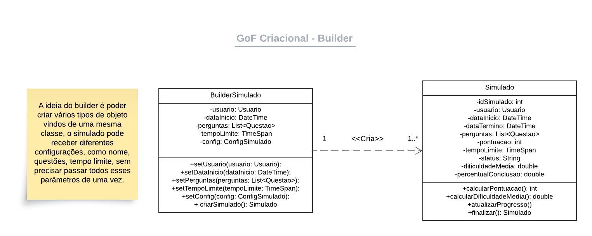
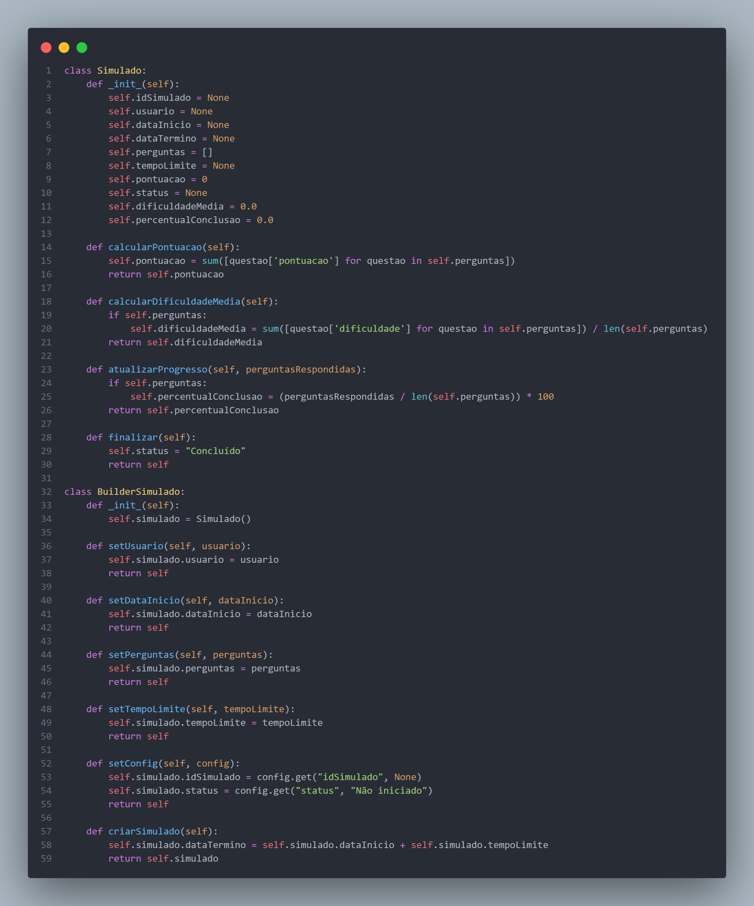
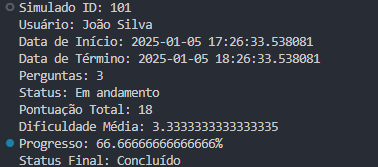

# **GoF Criacional**

## **1. Introdução**

O Builder é um padrão de projeto criacional que separa a construção de um objeto complexo de sua representação, permitindo que o mesmo processo de construção produza diferentes representações. Ele é especialmente útil quando a criação de um objeto requer muitas etapas ou configurações, e o código de construção se tornaria complicado se colocado diretamente no cliente ou no construtor da classe.

## **2. Metodologia**

A elaboração deste documento seguiu uma metodologia de pesquisa teórico-prática focada no padrão de projeto Builder. Inicialmente, realizou-se uma pesquisa bibliográfica, consultando fontes especializadas e portais de referência na indústria de software para compreender a teoria por trás do padrão Builder e suas aplicações no desenvolvimento de software. Posteriormente, foi realizada a modelagem UML do cenário, com o objetivo de ilustrar a estrutura e o funcionamento do padrão Builder, destacando como ele pode ser implementado para facilitar a construção de objetos complexos.

## **3. Modelagem e Contextualização do Builder no Sistema**

No contexto do nosso projeto, o uso do padrão de projeto Builder foi fundamental para simplificar a criação de objetos complexos compostos por diversas partes ou que exigem configurações específicas. Ao adotar o Builder, conseguimos reduzir a complexidade de construção, encapsulando a lógica em uma estrutura dedicada e evitando acoplamento excessivo no código principal, o que manteve a clareza em cada etapa da criação. Esse padrão também promoveu a reutilização e flexibilidade, permitindo que diferentes configurações do mesmo tipo de objeto fossem criadas de maneira eficiente, sem redundância. Além disso, facilitou a manutenção e expansão do sistema, pois a adição de novos atributos ou configurações ao objeto exigiu modificações apenas no Builder, sem afetar o código do cliente. A estrutura fluente do Builder também melhorou a legibilidade do código, tornando o processo de criação mais sequencial, intuitivo e alinhado com os objetivos do projeto. Dessa forma, o uso do padrão Builder não só lidou com a complexidade de maneira eficaz, mas também preparou o sistema para futuras mudanças, garantindo qualidade e escalabilidade à solução.

<figure markdown>

<b>GoF Criacional Builder - </b>Imagem 1

Fonte: [Ana Carolina](https://github.com/CarolCoCe), [Felipe de Oliveira](https://github.com/M0tt1nh4), [Giovanni Alvissus](https://github.com/giovanniacg) e [João Artur](https://github.com/joao-artl)

</figure>

## **4. Demonstração de Código e Exemplificação**

Abaixo está detalhado o código da implementação do padrão GoF Criacional **Builder**

<figure markdown>

<b>GoF Criacional -</b> Builder

Fonte: [Arthur Alves](https://github.com/Arthrok), [Diego Sousa](https://github.com/DiegoSousaLeite), [Julio Cesar](https://github.com/julio-dourado) e [Paulo Henrique](https://github.com/paulomh)

</figure>

**Classe Simulado**

A classe Simulado representa o modelo principal do simulador, contendo os atributos e comportamentos necessários para gerenciar um simulado.

Atributos:

- idSimulado: Identificador único do simulado.
- usuario: Usuário que realizará o simulado.
- dataInicio: Data e hora de início do simulado.
- dataTermino: Data e hora de término do simulado.
- perguntas: Lista de perguntas incluídas no simulado.
- tempoLimite: Tempo máximo permitido para a realização do simulado.
- pontuacao: Pontuação total do simulado.
- status: Status atual do simulado (ex.: "Em andamento", "Concluído").
- dificuldadeMedia: Média de dificuldade das perguntas.
- percentualConclusao: Percentual de progresso no simulado com base nas perguntas respondidas.

Métodos:

- calcularPontuacao(): Soma os valores de pontuação das perguntas para calcular a pontuação total do simulado.
- calcularDificuldadeMedia(): Calcula a dificuldade média com base nos valores atribuídos a cada pergunta.
- atualizarProgresso(perguntasRespondidas): Atualiza o percentual de conclusão com base no número de perguntas respondidas.
- finalizar(): Altera o status do simulado para "Concluído".

Essa classe encapsula toda a lógica relacionada ao gerenciamento de um simulado.

**Classe BuilderSimulado**

A classe BuilderSimulado implementa o padrão Builder para facilitar a criação de objetos do tipo Simulado. Com ela, é possível configurar o simulado passo a passo e garantir que ele seja construído corretamente.
Atributos:

- simulado: Instância da classe Simulado que será configurada e retornada.

Métodos:

- setUsuario(usuario): Define o usuário que realizará o simulado.
-setDataInicio(dataInicio): Define a data e hora de início.
- setPerguntas(perguntas): Adiciona uma lista de perguntas ao simulado.
- setTempoLimite(tempoLimite): Define o tempo limite para o simulado.
- setConfig(config): Configurações adicionais (ex.: idSimulado e status).
- criarSimulado(): Finaliza a configuração e retorna o objeto Simulado.

Essa classe promove um fluxo fluente (métodos encadeáveis), facilitando a leitura e a construção de objetos complexos.

**Saída**

<figure markdown>

<b>GoF Criacional -</b> Builder

Fonte: [Danilo Naves](https://github.com/DaniloNavesS)

</figure>

## **5. Análise e Conclusão**

O uso do padrão de projeto Builder no BuilderSimulador provou ser uma decisão estratégica e altamente eficaz para lidar com a complexidade inerente ao sistema. Durante o desenvolvimento, nos deparamos com a necessidade de criar objetos compostos por várias partes interdependentes e que poderiam variar conforme diferentes cenários de simulação. O padrão Builder permitiu que abordássemos esses desafios de forma organizada, flexível e extensível.

## **Referências Bibliográficas**

- REFACTORING.GURU. Builder design pattern. Disponível em: https://refactoring.guru/design-patterns/builder. Acesso em: 5 jan. 2025.
- Gamma, E., Helm, R., Johnson, R., & Vlissides, J. (1995). *Design Patterns: Elements of Reusable Object-Oriented Software*. Addison-Wesley.
- Fowler, M. (2002). *Patterns of Enterprise Application Architecture*. Addison-Wesley.
- Martin, R. C. (2017). *Clean Architecture: A Craftsman's Guide to Software Structure and Design*. Prentice Hall.

## **Histórico de Versão**

| Versão | Data       | Data de Revisão | Descrição do Documento                         | Autor(es)                                                | Revisor(es)                                       | Detalhes da revisão                                                                                         |
|-------|------------|-----------------|-------------------------------------------------|----------------------------------------------------------|---------------------------------------------------|-------------------------------------------------------------------------------------------------------------|
| `1.0`   | 04/01/2025 | 05/01/2025      | Criação do diagrama UML.                        | [Ana Carolina](https://github.com/CarolCoCe), [Felipe de Oliveira](https://github.com/M0tt1nh4), [Giovanni Alvissus](https://github.com/giovanniacg), [João Artur](https://github.com/joao-artl) | [Danilo Naves](https://github.com/DaniloNavesS) | [#7](https://github.com/UnBArqDsw2024-2/2024.2_G3_Aprender_Entrega_03/pull/7)|
| `1.1`   | 04/01/2025 | 05/01/2025      | Implementação do código de demonstração.           | [Arthur Alves](https://github.com/Arthrok), [Diego Sousa](https://github.com/DiegoSousaLeite), [Julio Cesar](https://github.com/julio-dourado), [Paulo Henrique](https://github.com/paulomh) | [Danilo Naves](https://github.com/DaniloNavesS)  | [#7](https://github.com/UnBArqDsw2024-2/2024.2_G3_Aprender_Entrega_03/pull/7)|
| `1.2`   | 05/01/2025 | 05/01/2025      | Documentação do padrão Builder.                | [Danilo Naves](https://github.com/DaniloNavesS)              |[Gustavo Melo](https://github.com/gusrberto) | [#7](https://github.com/UnBArqDsw2024-2/2024.2_G3_Aprender_Entrega_03/pull/7)|