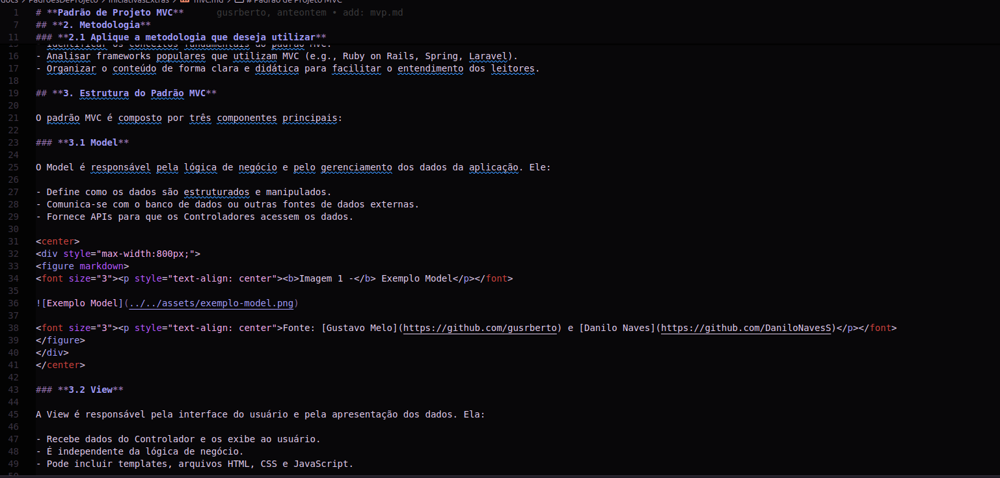
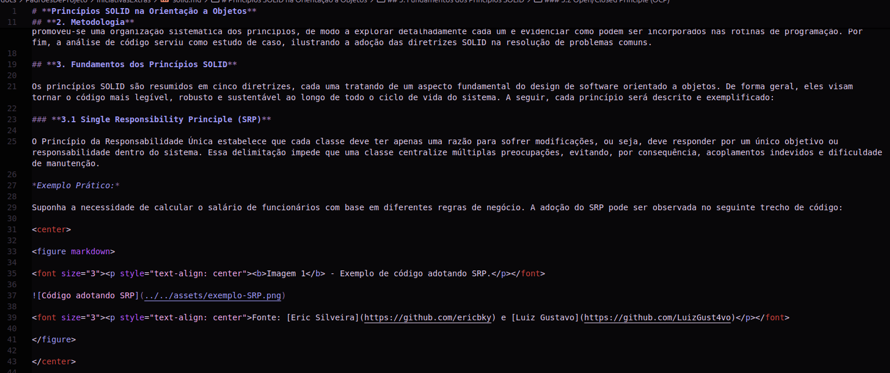

# Projeto G3_Aprender

**Código da Disciplina**: FGA0208 
**Número do Grupo**: 03 
**Entrega**: 01 

## Alunos

| Matrícula | Aluno |
| -- | -- |
| 190101750 | Ana Carolina |
| 222037657 | Arthur Alves |
| 221022515 | Danilo Naves |
| 221007994 | Diego Sousa |
| 221022266 | Eric Silveira |
| 221031158 | Felipe de Oliveira |
| 211043647 | Giovanni Alvissus |
| 211039457 | Gustavo Roberto |
| 221031185 | João Artur |
| 211030809 | Julio Cesar |
| 221022669 | Luiz Gustavo |
| 221022417 | Paulo Henrique |

## Sobre

Neste repositório, documentamos todos os artefatos desenvolvidos pelo grupo para a primeira entrega, abordando os seguintes aspectos principais:

- **Organização do Fluxo de Trabalho do Time**: Detalhamos o mapeamento dos processos internos e a distribuição das responsabilidades, assegurando uma visão clara do fluxo de trabalho. Essa organização inclui a definição de papéis, etapas de entrega e pontos de controle de qualidade, com o objetivo de otimizar a colaboração e a eficiência do time.

- **Estruturação em Squads para Organização Interna**: Implementamos uma divisão estratégica em squads, possibilitando uma organização mais focada e especializada dentro da equipe. Cada squad possui objetivos definidos e é composto por membros com competências específicas, garantindo que tarefas e projetos sejam conduzidos de maneira eficiente e autônoma.

- **Elaboração do Design Sprint**: Documentamos a aplicação de metodologias de Design Sprint para promover ciclos rápidos de prototipação e validação de ideias. Esse processo envolve sessões estruturadas de ideação, esboço de soluções, prototipagem e testes, visando reduzir o tempo de desenvolvimento e aumentar a qualidade das entregas iniciais.

- **Escolha e Implementação do BPMN Integrado a Metodologias Ágeis**: Optamos pelo uso do BPMN (Business Process Model and Notation) para modelar processos, integrando-o com práticas ágeis de desenvolvimento, como Scrum e Kanban, para garantir flexibilidade e controle sobre as atividades. Documentamos o processo de escolha e adaptação do BPMN para representar visualmente as etapas do projeto, oferecendo uma visão técnica precisa dos fluxos de trabalho e pontos críticos de tomada de decisão.

### Design Sprint

O Design Sprint está estruturado em cinco fases, iniciando com:

- **Compreender**
  - Realizamos um brainstorm para geração e idealização de ideias iniciais, incluindo pesquisa de mercado e contato com potenciais usuários.
  - A partir das pesquisas, definimos o tema central do projeto.

- **Divergir**
  - Criamos rich pictures e um mapa mental para consolidar e integrar as ideias, ajudando a entender o escopo e objetivos.
  - Desenvolvemos personas para visualizar o projeto a partir das perspectivas dos diferentes usuários, mapeando as necessidades de cada grupo-alvo.

- **Decidir**
  - Criamos uma Matriz SWOT para validar internamente as métricas de esforço relacionadas ao escopo do projeto.
  - Estruturamos os requisitos utilizando o Diagrama de Ishikawa para mapear possíveis riscos no desenvolvimento do produto. Além disso, desenvolvemos histórias de usuários com critérios de aceitação, definindo claramente os entregáveis e obtendo uma visão mais precisa do produto final.

- **Prototipar**
  - Esboçamos nossas ideias em formatos iniciais de telas, desenvolvendo protótipos de baixa fidelidade para obter uma visão preliminar do produto e facilitar ajustes com base no feedback.

- **Validar**
  - Os protótipos de baixa fidelidade permitiram ao grupo validar a interface e a funcionalidade com os públicos-alvo, identificando melhorias antes de evoluir para protótipos de alta fidelidade.

## Screenshots da Primeira Entrega

Adicione 2 ou mais screenshots em termos de artefatos realizados na entrega.

## Há algo a ser executado?

( ) SIM

( ) NÃO

Se SIM, insira um manual (ou um script) para auxiliar ainda mais os interessados na execução.

## Informações Complementares 

Quaisquer outras informações adicionais podem ser descritas nessa seção.

# Projeto G3_Aprender

**Código da Disciplina**: FGA0208  
**Número do Grupo**: 03  
**Entrega**: 03  

## Alunos

| Matrícula   | Aluno                                 | GitHub Profile                                                                              |
| ----------- | ------------------------------------- | --------------------------------------------------------------------------------------------|
| 190101750   | [Ana Carolina](https://github.com/CarolCoCe)         |        |
| 222037657   | [Arthur Alves](https://github.com/Arthrok)           |          |
| 221022515   | [Danilo Naves](https://github.com/DaniloNavesS)      |     |
| 221007994   | [Diego Sousa](https://github.com/DiegoSousaLeite)    |  |
| 221022266   | [Eric Silveira](https://github.com/ericbky)          |          |
| 221031158   | [Felipe de Oliveira](https://github.com/M0tt1nh4)    |         |
| 211043647   | [Giovanni Giampauli](https://github.com/giovanniacg)  |      |
| 211039457   | [Gustavo Melo](https://github.com/gusrberto)         |        |
| 221031185   | [João Artur](https://github.com/joao-artl)           |        |
| 211030809   | [Julio Cesar](https://github.com/julio-dourado)      |    |
| 221022669   | [Luiz Gustavo](https://github.com/LuizGust4vo)       |      |
| 221022417   | [Paulo Henrique](https://github.com/paulomh)         |          |

## Sobre 

Nesta terceira entrega, o grupo abordou o **Padrão GoF Comportamental** e explorou o **Padrão Strategy**, com foco na modelagem e implementação em um contexto prático. Esse padrão foi escolhido devido à sua capacidade de promover flexibilidade ao sistema, permitindo que diferentes comportamentos possam ser aplicados dinamicamente em tempo de execução.

A implementação foi contextualizada em um sistema de simulados, no qual diferentes estratégias de configuração e gerenciamento de simulados foram aplicadas, como estratégias padrão e personalizadas. O trabalho foi realizado com base no livro **Design Patterns: Elements of Reusable Object-Oriented Software** e em materiais complementares, como tutoriais e documentações de padrões de projeto.

## Screenshots da Terceira Entrega

### 3.5.1. MVC

Abaixo algumas screenshots dos princípios MVC, que foram abordados e exemplificados como mostra a screenshot a seguir:

<figure markdown>

<b>Imagem 1</b> - Screenshot MVC.

Fonte: [Eric Silveira](https://github.com/ericbky)

</figure>

### 3.5.2. SOLID

Abaixo algumas screenshots dos princípios SOLID, que foram abordados e exemplificados como mostra a screenshot a seguir:

<figure markdown>

<b>Imagem 2</b> - Screenshot SOLID.

Fonte: [Eric Silveira](https://github.com/ericbky)

</figure>

## Há algo a ser executado?

( ) SIM
**(X) NÃO**  

## Informações Complementares 

O grupo também produziu artefatos extras relacionados a estudos sobre **MVC** e **princípios SOLID**, conectando esses conceitos aos padrões de projeto trabalhados para construir um sistema robusto e escalável.  